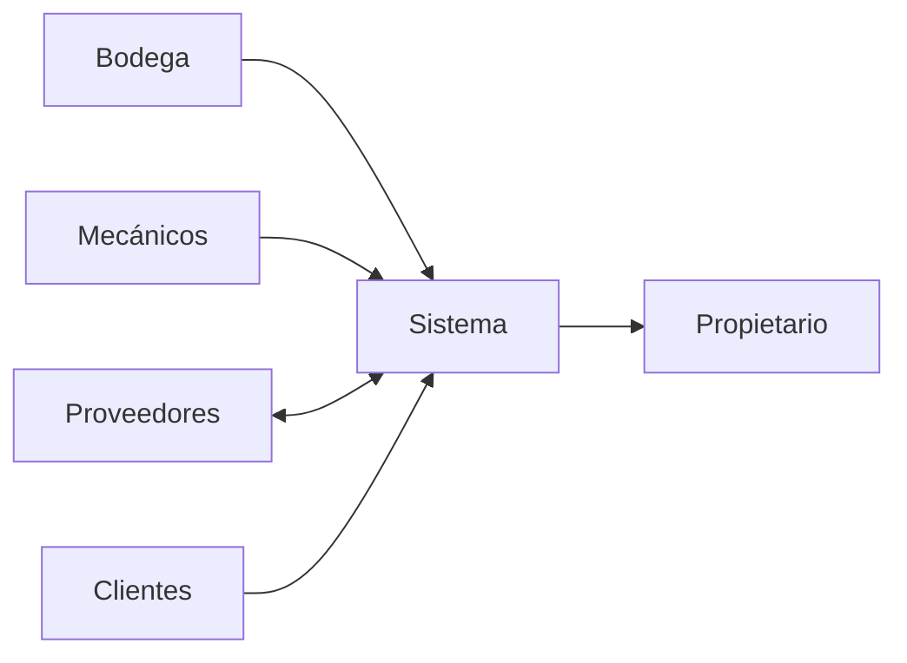

# Diapositivas para defensa de Fase 2

> Formato sugerido: 12 diapositivas.  
> Estilo sugerido: fondo claro, tipografía legible, pocos textos por lámina, capturas reales cuando el sistema esté implementado.

---

## Diapositiva 1: Portada

**Sistema de Gestión de Inventario de Repuestos**  
**Taller Mecánico San José**

Análisis y Diseño de Sistemas  
Docente: Juan Antonio Miranda Figueroa  
Estudiante: Enrique Alejandro García Villeda - GV200136  
Ciudadela Don Bosco, 21 de mayo de 2026

**Visual sugerido:** fotografía o ícono sobrio relacionado con taller/inventario, sin saturar.

---

## Diapositiva 2: Punto de partida

**El taller trabaja con información dispersa.**

- Entradas y salidas registradas en libretas.
- Proveedores guardados en agendas, facturas y hojas de cálculo.
- Clientes y vehículos registrados en papel.
- Reportes elaborados manualmente cuando el propietario los necesita.

**Mensaje oral:** El problema no es solo tecnológico; es de control. La información existe, pero no está disponible en el momento correcto.

---

## Diapositiva 3: Problema principal

**El inventario registrado no siempre coincide con el inventario real.**

- Las salidas no siempre se anotan al momento.
- No hay alertas de stock mínimo.
- Buscar repuestos toma tiempo.
- La compra de piezas se vuelve reactiva.
- El historial de servicios no queda relacionado con clientes y vehículos.

**Visual sugerido:** diagrama simple: papel/Excel -> errores -> retrasos -> decisiones débiles.

---

## Diapositiva 4: Objetivo del sistema

**Centralizar inventario, compras, clientes, vehículos y reportes en una aplicación web.**

**Objetivos específicos:**

1. Analizar el proceso actual y sus fallas.
2. Diseñar base de datos, casos de uso, actividades, componentes e interfaces.
3. Preparar una versión funcional inicial con PHP, MySQL y Bootstrap.

---

## Diapositiva 5: Requerimientos del sistema

**Cuatro módulos sostienen la solución.**

| Módulo | Qué resuelve |
|---|---|
| Inventario | Repuestos, entradas, salidas, stock mínimo |
| Proveedores y compras | Contactos, órdenes, recepción de mercadería |
| Clientes y vehículos | Datos de clientes, vehículos e historial |
| Reportes | Inventario, movimientos, compras y clientes frecuentes |

**Mensaje oral:** Estos módulos vienen directamente de los procesos detectados en el análisis.

---

## Diapositiva 6: Flujo general de información

**El sistema conecta a bodega, proveedores, clientes y propietario.**

**Visual final recomendado:** reemplazar este esquema por el DFD de contexto exportado como imagen.

---

## Diapositiva 7: Base de datos propuesta

**El modelo separa catálogo, movimientos y operaciones.**

Entidades principales:

- usuarios
- repuestos
- movimientos_inventario
- proveedores
- compras
- detalle_compra
- clientes
- vehículos
- servicios
- detalle_servicio_repuesto

**Mensaje oral:** La tabla de movimientos es clave porque permite reconstruir la historia del inventario, no solo ver el stock actual.

---

## Diapositiva 8: Casos de uso principales

**La versión inicial cubre el trabajo diario del taller.**

- Iniciar sesión.
- Gestionar repuestos.
- Registrar entrada de inventario.
- Registrar salida de inventario.
- Gestionar proveedores.
- Registrar compra.
- Recibir mercadería.
- Gestionar clientes y vehículos.
- Consultar e imprimir reportes.

**Visual sugerido:** captura o diagrama de casos de uso.

---

## Diapositiva 9: Diseño funcional del sistema

**Pantallas previstas para el avance funcional.**

1. Login.
2. Dashboard.
3. Inventario.
4. Formulario de repuesto.
5. Movimiento de inventario.
6. Proveedores.
7. Compras.
8. Clientes y vehículos.
9. Reportes.

**Nota para cuando exista el sistema:** colocar miniaturas de capturas reales en una grilla 3x3.

---

## Diapositiva 10: Avance funcional esperado al 50%

**El 50% no significa medio diseño; significa una base operativa demostrable.**

Debe permitir:

- Acceso con sesión y roles básicos.
- CRUD de repuestos, proveedores, clientes y vehículos.
- Entradas y salidas con actualización de stock.
- Registro de compras y recepción de mercadería.
- Dashboard con indicadores.
- Reportes imprimibles.
- Validaciones y mensajes de error.

**Mensaje oral:** La idea es que el docente pueda navegar el sistema y probar flujos reales, aunque todavía no sea la versión final.

---

## Diapositiva 11: Arquitectura técnica

**Stack definido: PHP + MySQL + Bootstrap.**

Capas sugeridas:

- Vistas Bootstrap.
- Controladores PHP.
- Servicios de negocio.
- Repositorios SQL.
- Base de datos MySQL.

---

## Diapositiva 12: Cierre

**El diseño deja listo el camino para construir y demostrar el sistema.**

- El problema está delimitado.
- Los requerimientos están conectados con procesos reales.
- La base de datos cubre las operaciones principales.
- Los casos de uso explican cómo interactúa cada actor.
- La especificación SDD permite implementar el avance funcional con menos ambigüedad.

**Frase de cierre sugerida:**  
“El sistema propuesto no busca reemplazar el criterio del personal del taller; busca darle información confiable para trabajar con menos retrasos y menos registros perdidos.”
