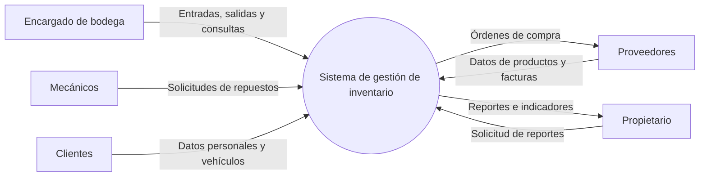
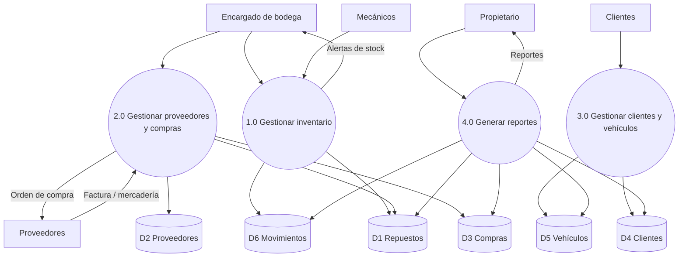
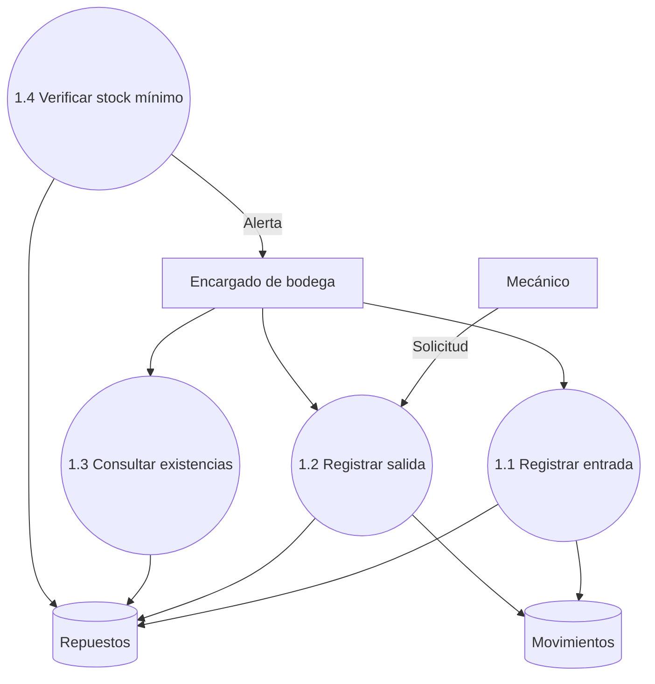
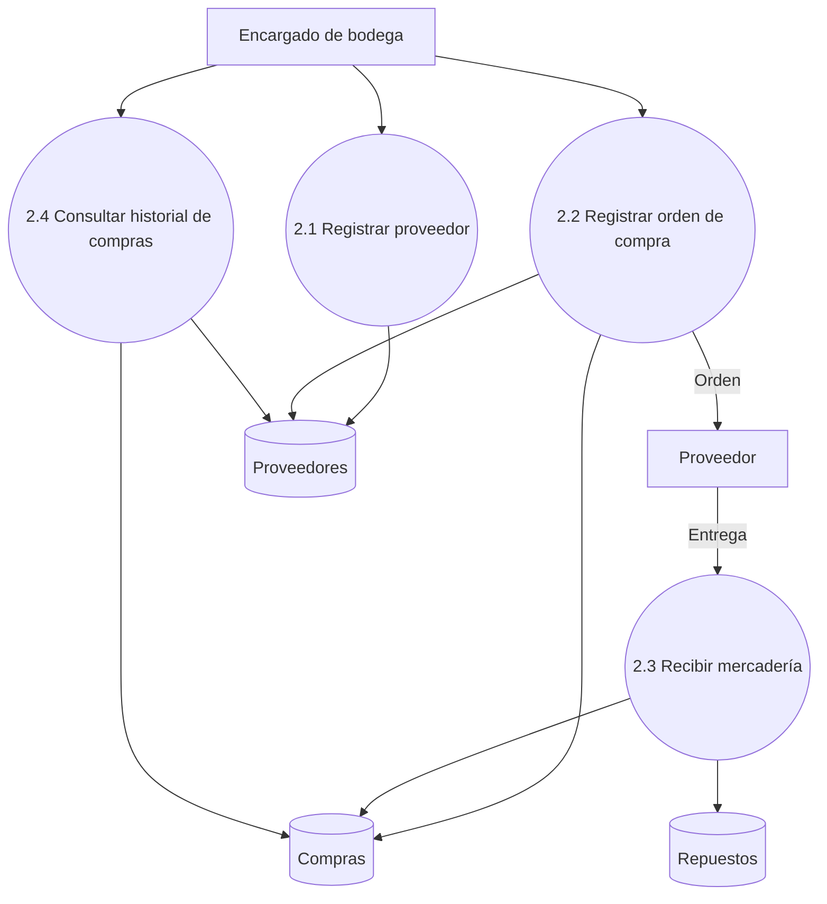
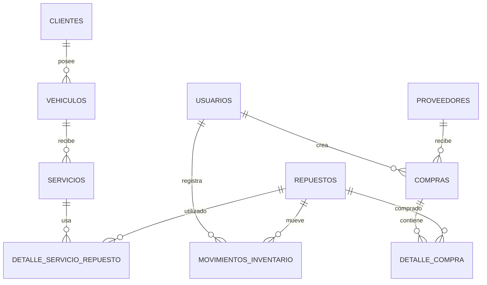
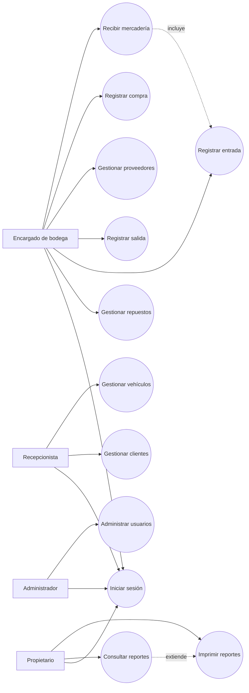
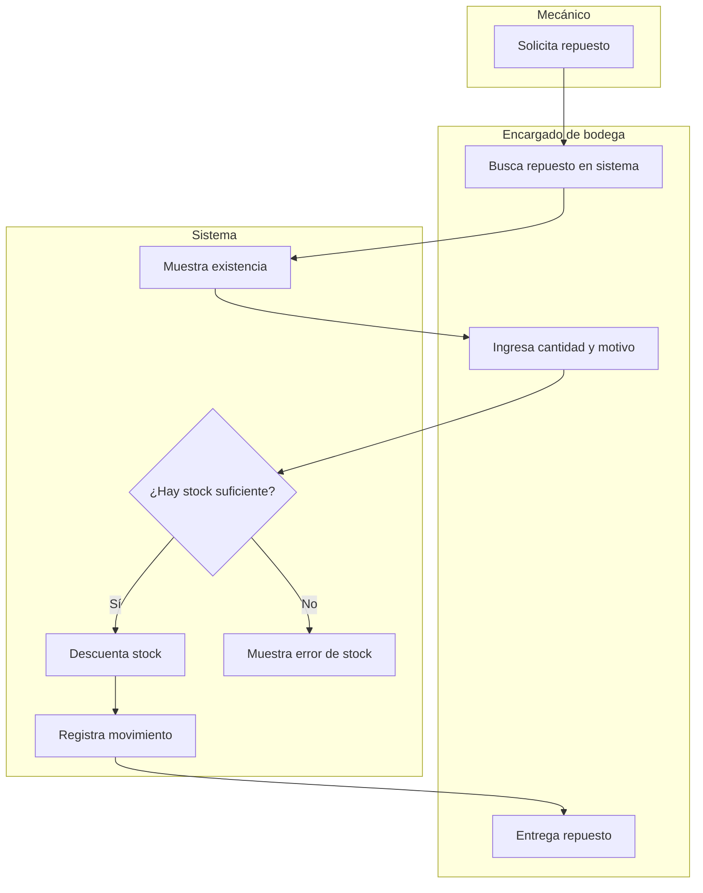
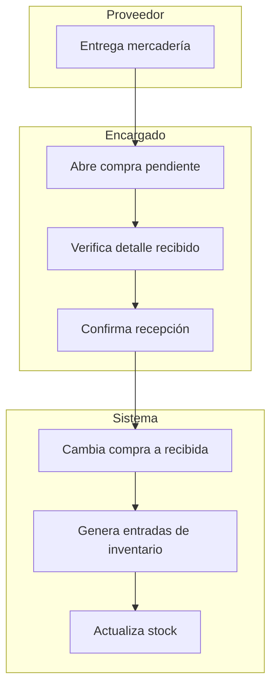
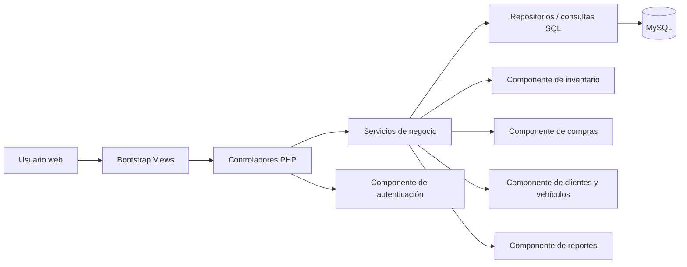

# UNIVERSIDAD DON BOSCO

**ANÁLISIS Y DISEÑO DE SISTEMAS**  
**Docente:** Juan Antonio Miranda Figueroa  

## SISTEMA DE GESTIÓN DE INVENTARIO DE REPUESTOS  
## TALLER MECÁNICO SAN JOSÉ

**Integrante**

| Apellidos | Nombres | Carné |
|---|---|---|
| García Villeda | Enrique Alejandro | GV200136 |

Ciudadela Don Bosco, 21 de mayo de 2026.

\pagebreak

# Índice

1. Introducción  
2. Descripción del problema  
   2.1 Actividad principal de la empresa  
   2.2 Problema a solucionar  
   2.3 Situación actual  
3. Justificación e importancia  
4. Objetivos  
   4.1 Objetivo general  
   4.2 Objetivos específicos  
5. Metodologías de recolección de información  
   5.1 Entrevista  
   5.2 Cuestionario  
   5.3 Observación  
   5.4 Metodologías seleccionadas para el proyecto  
6. Investigación preliminar  
   6.1 Determinación de requerimientos  
7. Diagramas de flujo de datos  
   7.1 Diagrama de contexto o nivel cero  
   7.2 Diagrama de primer nivel  
   7.3 Diagramas de segundo nivel  
8. Modelo de base de datos  
   8.1 Modelo entidad-relación  
   8.2 Modelo relacional  
   8.3 Datos de prueba requeridos  
9. Diagrama de casos de uso y escenarios  
10. Diagrama de actividades y carriles  
11. Diagrama de componentes  
12. Anexos  
   12.1 Instrumento utilizado en la recolección de información  
   12.2 Diseño de interfaz del sistema  
13. Referencias bibliográficas  

\pagebreak

# 1. Introducción

El presente documento corresponde al segundo avance del proyecto de cátedra de Análisis y Diseño de Sistemas. El trabajo desarrolla el análisis y diseño de un sistema de gestión de inventario de repuestos para el Taller Mecánico San José, un negocio dedicado a la reparación y mantenimiento de vehículos livianos y pesados.

La propuesta surge a partir de una situación común en talleres pequeños y medianos: el inventario se controla con libretas, hojas sueltas y archivos de Excel que no siempre se actualizan a tiempo. Esto provoca diferencias entre la existencia real y la existencia registrada, retrasos en los trabajos mecánicos, compras poco planificadas y dificultad para consultar información histórica.

En esta fase se retoma el análisis inicial y se amplía con el diseño de base de datos, casos de uso, escenarios, diagramas de actividades, diagrama de componentes y especificación de interfaces. El objetivo es dejar una base clara para construir una primera versión funcional del sistema con PHP, MySQL y Bootstrap.

# 2. Descripción del problema

## 2.1 Actividad principal de la empresa

El Taller Mecánico San José presta servicios de revisión, reparación y mantenimiento de automóviles y camiones. Para realizar su trabajo necesita administrar repuestos, proveedores, compras, clientes y vehículos. La bodega cumple un papel central, porque de ella dependen los tiempos de atención y la continuidad de las reparaciones.

En el funcionamiento diario participan el propietario, el encargado de bodega, la recepcionista y los mecánicos. El propietario necesita información para tomar decisiones; el encargado de bodega registra entradas y salidas de repuestos; los mecánicos solicitan piezas para ejecutar los servicios; y la recepcionista administra datos de clientes y vehículos.

## 2.2 Problema a solucionar

El problema principal es la falta de un sistema integrado para controlar el inventario de repuestos. Actualmente la información se encuentra dispersa en libretas, folders, hojas de cálculo y documentos físicos. Esta forma de trabajo dificulta conocer las existencias reales, revisar el historial de movimientos, identificar productos con bajo stock y consultar compras anteriores.

La situación también afecta la atención al cliente. Cuando un vehículo regresa al taller, el personal debe buscar datos en papeles archivados sin un orden uniforme. En varios casos se vuelve a pedir información que ya debería estar disponible. Esto consume tiempo, genera errores y reduce la capacidad del taller para dar seguimiento a sus servicios.

## 2.3 Situación actual

Cuando ingresa mercadería, el encargado de bodega anota a mano el nombre del repuesto, cantidad, proveedor, número de parte y fecha. Las salidas dependen de que el encargado registre el movimiento en el momento en que un mecánico solicita una pieza. Si el taller está ocupado, ese registro puede quedar pendiente o no realizarse. Con el tiempo, la libreta deja de reflejar lo que realmente existe en los estantes.

Los datos de proveedores se guardan en agendas, tarjetas, facturas y hojas de Excel. Las compras no tienen un historial centralizado, por lo que resulta difícil comparar precios, revisar compras por proveedor o saber cuánto se ha invertido en un período. Los clientes y vehículos también se registran en papel, lo cual vuelve lenta la búsqueda de antecedentes.

Esta situación limita el control administrativo del taller. El propietario no puede obtener reportes confiables sin revisar manualmente varias fuentes de información. Por esa razón se propone un sistema web que centralice los registros y permita consultar información actualizada.

# 3. Justificación e importancia

El desarrollo del sistema es importante porque permite sustituir un proceso manual por un flujo de trabajo más ordenado y verificable. Un inventario digital ayuda a saber qué repuestos están disponibles, cuáles se han movido recientemente y cuáles deben comprarse antes de que afecten el servicio.

La solución también mejora la trazabilidad. Cada entrada y salida queda asociada a un usuario, fecha, cantidad y motivo. Con esa información se pueden detectar errores, revisar consumos frecuentes y tomar decisiones de compra con base en datos concretos.

Para el taller, el beneficio no se limita a tener pantallas nuevas. El valor está en reducir pérdidas por registros incompletos, evitar compras duplicadas, responder más rápido a los mecánicos y conservar el historial de clientes y vehículos. Para el proyecto académico, el caso permite aplicar análisis de requerimientos, modelado de datos, UML, diseño de interfaces y construcción de una aplicación web con base en un problema realista.

# 4. Objetivos

## 4.1 Objetivo general

Desarrollar el análisis y diseño de un sistema web que permita al Taller Mecánico San José registrar, controlar y consultar su inventario de repuestos, proveedores, compras, clientes, vehículos y reportes, reemplazando los registros manuales por una solución digital organizada.

## 4.2 Objetivos específicos

1. Analizar el proceso actual de manejo de inventario, compras, clientes y vehículos para identificar fallas, participantes, documentos utilizados y oportunidades de mejora.
2. Diseñar los modelos de datos, casos de uso, escenarios, actividades, componentes e interfaces principales del sistema propuesto.
3. Definir una base funcional del sistema que pueda implementarse con PHP, MySQL y Bootstrap, priorizando los módulos necesarios para presentar un avance operativo del 50%.

# 5. Metodologías de recolección de información

## 5.1 Entrevista

La entrevista permite conversar directamente con las personas que conocen el funcionamiento del taller. Es útil cuando se necesita comprender procesos internos, excepciones, problemas repetidos y expectativas sobre una nueva herramienta. Puede ser estructurada, semiestructurada o libre. Para este proyecto se considera más conveniente la entrevista estructurada, porque facilita comparar respuestas y mantener el enfoque en los procesos de inventario.

## 5.2 Cuestionario

El cuestionario permite recopilar información de varias personas en poco tiempo. En este caso se dirige a los mecánicos, quienes solicitan repuestos durante la jornada y conocen de primera mano los retrasos que provoca la falta de piezas o la desorganización de la bodega. Las preguntas cerradas ayudan a tabular resultados; las preguntas abiertas permiten recoger comentarios breves sobre necesidades específicas.

## 5.3 Observación

La observación consiste en revisar directamente cómo se realiza el trabajo. En un taller mecánico puede revelar pasos que los empleados no mencionan porque ya los consideran normales: buscar piezas en estantes sin codificación, consultar libretas, esperar confirmación del encargado o revisar facturas para recordar precios. Aunque no será el método principal, se considera útil como apoyo para validar lo dicho en entrevistas y cuestionarios.

## 5.4 Metodologías seleccionadas para el proyecto

Para el proyecto se seleccionan dos métodos principales: entrevista estructurada y cuestionario. La entrevista se aplicará al propietario y al encargado de bodega. El cuestionario se dirigirá a los mecánicos. La combinación permite obtener una visión administrativa y operativa del problema.

# 6. Investigación preliminar

## 6.1 Determinación de requerimientos

### Requerimiento 1: Registro y control de inventario de repuestos

**Descripción actual del proceso:**  
El inventario se registra en libretas y hojas sueltas. Cuando llega mercadería, el encargado anota los datos básicos. Cuando un mecánico solicita un repuesto, el encargado revisa manualmente si hay existencia. El registro de salida no siempre se realiza al momento, lo que provoca diferencias entre el inventario físico y el registro escrito.

**Documentación o formulario asociado:**  
Libreta de entradas y salidas, hojas de existencias, notas internas.

**Participantes:**  
Encargado de bodega, mecánicos y propietario.

**Mejoramiento propuesto:**  
Crear un módulo que permita registrar repuestos, entradas, salidas, stock mínimo, búsqueda por nombre, código o número de parte, y consulta del historial de movimientos.

### Requerimiento 2: Registro de proveedores y compras

**Descripción actual del proceso:**  
Los datos de proveedores se encuentran en agendas, tarjetas, facturas y archivos de Excel. Las compras no se registran de forma centralizada, por lo que se dificulta consultar precios, historial y proveedores frecuentes.

**Documentación o formulario asociado:**  
Facturas de compra, tarjetas de contacto, hojas de cálculo.

**Participantes:**  
Propietario, encargado de bodega y proveedores.

**Mejoramiento propuesto:**  
Crear un módulo para registrar proveedores, órdenes de compra, detalle de productos, recepción de mercadería e historial de compras. Al recibir mercadería, el inventario debe actualizarse automáticamente.

### Requerimiento 3: Registro de clientes y vehículos

**Descripción actual del proceso:**  
Los datos de clientes y vehículos se guardan en papel. Cuando un cliente regresa, el personal busca su información en archivos físicos. A veces los datos no aparecen o están incompletos.

**Documentación o formulario asociado:**  
Hojas de clientes, órdenes de trabajo, notas de servicios.

**Participantes:**  
Recepcionista, mecánicos y clientes.

**Mejoramiento propuesto:**  
Crear un módulo que registre clientes y asocie uno o más vehículos a cada cliente. Cada vehículo debe guardar marca, modelo, año, placa, tipo de motor e historial básico de servicios y repuestos usados.

### Requerimiento 4: Generación de reportes e informes

**Descripción actual del proceso:**  
Los reportes se elaboran manualmente revisando libretas, hojas de Excel y facturas. Esto toma tiempo y no siempre produce datos confiables.

**Documentación o formulario asociado:**  
No existe un formato formal. La información se recopila cuando se necesita.

**Participantes:**  
Propietario y encargado de bodega.

**Mejoramiento propuesto:**  
Crear reportes de inventario, movimientos por período, compras por proveedor, repuestos más utilizados y clientes frecuentes. Los reportes deben poder imprimirse desde el navegador.

# 7. Diagramas de flujo de datos

## 7.1 Diagrama de contexto o nivel cero

## 7.2 Diagrama de primer nivel

## 7.3 Diagramas de segundo nivel

### Proceso 1.0: Gestionar inventario

### Proceso 2.0: Gestionar proveedores y compras

# 8. Modelo de base de datos

## 8.1 Modelo entidad-relación

## 8.2 Modelo relacional

**usuarios**  
id_usuario PK, nombre, correo, password_hash, rol, estado, creado_en

**proveedores**  
id_proveedor PK, nombre, contacto, telefono, correo, direccion, productos_ofrecidos, estado

**repuestos**  
id_repuesto PK, codigo, numero_parte, nombre, descripcion, marca, ubicacion, precio_referencia, stock_actual, stock_minimo, estado

**movimientos_inventario**  
id_movimiento PK, id_repuesto FK, id_usuario FK, tipo_movimiento, cantidad, motivo, referencia, fecha_movimiento

**compras**  
id_compra PK, id_proveedor FK, id_usuario FK, fecha_compra, estado, total_estimado, observaciones

**detalle_compra**  
id_detalle_compra PK, id_compra FK, id_repuesto FK, cantidad, precio_unitario, subtotal

**clientes**  
id_cliente PK, nombre, telefono, correo, direccion, estado

**vehiculos**  
id_vehiculo PK, id_cliente FK, marca, modelo, anio, placa, tipo_motor, color, estado

**servicios**  
id_servicio PK, id_vehiculo FK, fecha_servicio, descripcion, kilometraje, observaciones

**detalle_servicio_repuesto**  
id_detalle_servicio PK, id_servicio FK, id_repuesto FK, cantidad_usada

## 8.3 Datos de prueba requeridos

Para cumplir con la guía, la base debe cargarse con al menos 50 registros de prueba distribuidos así:

| Tabla | Cantidad mínima |
|---|---:|
| usuarios | 4 |
| proveedores | 8 |
| repuestos | 20 |
| compras | 6 |
| detalle_compra | 12 |
| clientes | 10 |
| vehículos | 10 |
| movimientos_inventario | 20 |

# 9. Diagrama de casos de uso y escenarios

## 9.1 Actores

- Administrador: configura usuarios, consulta todo el sistema y revisa reportes.
- Encargado de bodega: administra repuestos, movimientos, proveedores y compras.
- Recepcionista: registra clientes y vehículos.
- Propietario: consulta reportes y estado general.

## 9.2 Diagrama de casos de uso

## 9.3 Escenarios principales

### Caso de uso: Iniciar sesión

**Propósito:** Permitir el acceso seguro al sistema.  
**Actores:** Administrador, encargado de bodega, recepcionista y propietario.  
**Activación:** El usuario abre la página de inicio de sesión.  

**Flujo principal:**

1. El sistema muestra el formulario de correo y contraseña.
2. El usuario ingresa sus credenciales.
3. El sistema valida que los campos no estén vacíos.
4. El sistema busca el usuario por correo.
5. El sistema verifica la contraseña cifrada.
6. El sistema crea la sesión y redirige al dashboard según el rol.

**Flujo alternativo:** Si las credenciales son incorrectas, el sistema muestra un mensaje de error sin revelar cuál dato falló.

### Caso de uso: Gestionar repuestos

**Propósito:** Registrar y mantener actualizado el catálogo de repuestos.  
**Actor:** Encargado de bodega.  
**Activación:** El actor ingresa al módulo de inventario.  

**Flujo principal:**

1. El sistema muestra la lista de repuestos con buscador.
2. El actor selecciona crear, editar o consultar un repuesto.
3. El sistema valida código, nombre, stock mínimo y precio.
4. El sistema guarda los datos.
5. El sistema actualiza la lista y muestra confirmación.

### Caso de uso: Registrar entrada de repuestos

**Propósito:** Aumentar la existencia de un repuesto y dejar historial del movimiento.  
**Actor:** Encargado de bodega.  
**Activación:** Llega mercadería o se confirma una compra.  

**Flujo principal:**

1. El actor selecciona el repuesto.
2. El sistema muestra existencia actual.
3. El actor ingresa cantidad, motivo y referencia.
4. El sistema valida que la cantidad sea mayor que cero.
5. El sistema suma la cantidad al stock actual.
6. El sistema registra el movimiento.

### Caso de uso: Registrar salida de repuestos

**Propósito:** Descontar repuestos entregados a mecánicos o utilizados en servicios.  
**Actor:** Encargado de bodega.  
**Activación:** Un mecánico solicita una pieza.  

**Flujo principal:**

1. El actor busca el repuesto solicitado.
2. El sistema muestra la existencia disponible.
3. El actor ingresa cantidad y motivo de salida.
4. El sistema verifica que exista stock suficiente.
5. El sistema descuenta la cantidad.
6. El sistema registra el movimiento.

**Flujo alternativo:** Si no hay stock suficiente, el sistema bloquea la salida y muestra la existencia disponible.

### Caso de uso: Registrar compra

**Propósito:** Guardar una orden de compra y su detalle.  
**Actor:** Encargado de bodega.  
**Activación:** Se realiza un pedido a proveedor.  

**Flujo principal:**

1. El actor selecciona proveedor.
2. El sistema muestra el formulario de compra.
3. El actor agrega repuestos, cantidades y precios.
4. El sistema calcula subtotales y total.
5. El actor guarda la compra en estado pendiente.

### Caso de uso: Recibir mercadería

**Propósito:** Marcar una compra como recibida y actualizar inventario.  
**Actor:** Encargado de bodega.  
**Activación:** El proveedor entrega el pedido.  

**Flujo principal:**

1. El actor abre una compra pendiente.
2. El sistema muestra el detalle de productos.
3. El actor confirma la recepción.
4. El sistema cambia el estado de la compra a recibida.
5. El sistema registra entradas de inventario por cada repuesto.

### Caso de uso: Gestionar clientes y vehículos

**Propósito:** Registrar datos de clientes y sus vehículos.  
**Actor:** Recepcionista.  
**Activación:** Un cliente solicita servicio o actualiza sus datos.  

**Flujo principal:**

1. El actor registra o busca al cliente.
2. El sistema valida teléfono y nombre.
3. El actor agrega los datos del vehículo.
4. El sistema valida que la placa no esté duplicada.
5. El sistema guarda la relación cliente-vehículo.

### Caso de uso: Consultar reportes

**Propósito:** Presentar información útil para decisiones del propietario.  
**Actor:** Propietario.  
**Activación:** El actor ingresa al módulo de reportes.  

**Flujo principal:**

1. El sistema muestra tipos de reporte.
2. El actor selecciona inventario, movimientos, compras o clientes.
3. El actor define filtros de fecha o búsqueda.
4. El sistema consulta la base de datos.
5. El sistema muestra resultados listos para imprimir.

# 10. Diagrama de actividades y carriles

## 10.1 Registro de salida de repuesto

## 10.2 Recepción de mercadería

# 11. Diagrama de componentes

El sistema se organizará en capas sencillas. Las vistas Bootstrap mostrarán formularios, tablas y mensajes. Los controladores PHP recibirán peticiones, validarán sesión y enviarán datos a los servicios. Los servicios concentrarán reglas de negocio como no permitir salidas sin stock o actualizar inventario al recibir una compra. Los repositorios ejecutarán consultas hacia MySQL.

# 12. Anexos

## 12.1 Instrumento utilizado en la recolección de información

### Entrevista estructurada

Dirigida a: propietario y encargado de bodega.  
Objetivo: conocer el proceso actual de inventario, compras, clientes y reportes.

1. ¿Cuál es la actividad principal del Taller Mecánico San José?
2. ¿Cuántos empleados trabajan actualmente y qué funciones desempeñan?
3. ¿Cómo se registra el ingreso de repuestos a bodega?
4. ¿Qué datos se anotan de cada repuesto?
5. ¿Cómo se controla la salida de repuestos?
6. ¿Con qué frecuencia hay diferencias entre existencias registradas y reales?
7. ¿Cómo se gestionan los proveedores?
8. ¿Cómo se registran clientes y vehículos?
9. ¿Qué reportes necesita el propietario?
10. ¿Qué funciones considera indispensables en un nuevo sistema?

### Cuestionario para mecánicos

Objetivo: conocer la experiencia diaria al solicitar repuestos.

1. ¿Con qué frecuencia solicita repuestos a bodega?  
   a) Varias veces al día b) Una vez al día c) Algunas veces a la semana d) Pocas veces
2. ¿Considera eficiente el proceso actual?  
   a) Sí b) No c) A veces
3. ¿Ha tenido retrasos por falta de repuestos?  
   a) Frecuentemente b) Ocasionalmente c) Nunca
4. ¿Cómo califica la organización actual del inventario?  
   a) Buena b) Regular c) Mala
5. ¿Sería útil consultar disponibilidad en un sistema digital?  
   a) Muy útil b) Útil c) Poco útil d) Innecesario
6. ¿Qué información le gustaría consultar?  
   a) Existencias b) Ubicación c) Precio d) Todas las anteriores

## 12.2 Diseño de interfaz del sistema

> Nota para la entrega final: reemplazar cada placeholder por una captura real del sistema implementado.

### Pantalla 1: Inicio de sesión

**Objetivo:** permitir acceso seguro por correo y contraseña.  
**Elementos visibles:** logo o nombre del taller, campo correo, campo contraseña, botón ingresar, mensaje de error.  
**Relación con casos de uso:** Iniciar sesión.

**Captura pendiente:** `[Insertar captura: login.png]`

### Pantalla 2: Dashboard

**Objetivo:** mostrar resumen operativo.  
**Elementos visibles:** total de repuestos, alertas de stock bajo, compras pendientes, clientes registrados, accesos rápidos.  
**Relación con casos de uso:** Consultar reportes, gestionar inventario.

**Captura pendiente:** `[Insertar captura: dashboard.png]`

### Pantalla 3: Inventario de repuestos

**Objetivo:** listar, buscar, crear y editar repuestos.  
**Elementos visibles:** tabla de repuestos, buscador, botón nuevo, acciones editar/ver movimientos, indicador de stock bajo.  
**Relación con casos de uso:** Gestionar repuestos.

**Captura pendiente:** `[Insertar captura: repuestos-listado.png]`

### Pantalla 4: Formulario de repuesto

**Objetivo:** registrar datos completos de un repuesto.  
**Elementos visibles:** código, número de parte, nombre, descripción, marca, ubicación, stock mínimo, precio referencia, estado.  
**Relación con casos de uso:** Gestionar repuestos.

**Captura pendiente:** `[Insertar captura: repuesto-formulario.png]`

### Pantalla 5: Movimiento de inventario

**Objetivo:** registrar entradas y salidas.  
**Elementos visibles:** repuesto, tipo de movimiento, cantidad, motivo, referencia, existencia actual.  
**Relación con casos de uso:** Registrar entrada, registrar salida.

**Captura pendiente:** `[Insertar captura: movimiento-inventario.png]`

### Pantalla 6: Proveedores

**Objetivo:** administrar proveedores.  
**Elementos visibles:** tabla, buscador, contacto, teléfono, correo, productos ofrecidos, acciones.  
**Relación con casos de uso:** Gestionar proveedores.

**Captura pendiente:** `[Insertar captura: proveedores.png]`

### Pantalla 7: Compras

**Objetivo:** registrar órdenes de compra y recepción.  
**Elementos visibles:** proveedor, fecha, estado, detalle de productos, cantidades, precios, total, botón recibir mercadería.  
**Relación con casos de uso:** Registrar compra, recibir mercadería.

**Captura pendiente:** `[Insertar captura: compras.png]`

### Pantalla 8: Clientes y vehículos

**Objetivo:** registrar clientes y asociar vehículos.  
**Elementos visibles:** datos del cliente, lista de vehículos, formulario de vehículo, placa, marca, modelo, año, tipo de motor.  
**Relación con casos de uso:** Gestionar clientes, gestionar vehículos.

**Captura pendiente:** `[Insertar captura: clientes-vehiculos.png]`

### Pantalla 9: Reportes

**Objetivo:** consultar información para toma de decisiones.  
**Elementos visibles:** filtros, reporte de inventario, movimientos, compras por proveedor, clientes frecuentes, botón imprimir.  
**Relación con casos de uso:** Consultar reportes, imprimir reportes.

**Captura pendiente:** `[Insertar captura: reportes.png]`

# 13. Referencias bibliográficas

Kendall, K. E., & Kendall, J. E. (2011). *Análisis y diseño de sistemas* (8.a ed.). Pearson Educación.

Whitten, J. L., Bentley, L. D., & Dittman, K. C. (2004). *Systems analysis and design methods* (6th ed.). McGraw-Hill.

Sommerville, I. (2011). *Ingeniería de software* (9.a ed.). Pearson Educación.

Bootstrap Team. (2026). *Bootstrap documentation*. https://getbootstrap.com/

PHP Group. (2026). *PHP manual*. https://www.php.net/manual/

Oracle. (2026). *MySQL documentation*. https://dev.mysql.com/doc/
